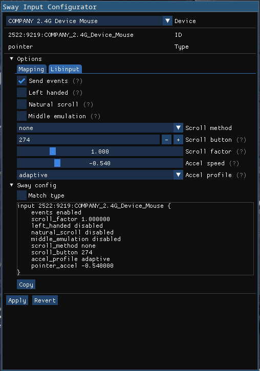

# Sway Input Configurator
Create and/or apply your SwayWM configuration for input device using GUI

## Dependencies
- [ImGui Wrapper](https://github.com/TheRetikGM/imguiwrapper.git) (downloaded automatically)
- Slurp (optional)
- Sway
- glfw

## Build

	git clone https://github.com/TheRetikGM/swic
	cd swic
	meson setup build && meson compile -C build

## TODO
- [ ] Command line option for disabling safe mode
- [ ] xkb options such as ~~numlock enabling~~ and keyboard languages
- [ ] Handle loading default values for parameters which cannot be retrieved from swaymsg calls
	- [ ] Implement reverting of applied values for these parameters
- [ ] Meson install setup
- [ ] Ability to save and load configuration profiles for input devices
